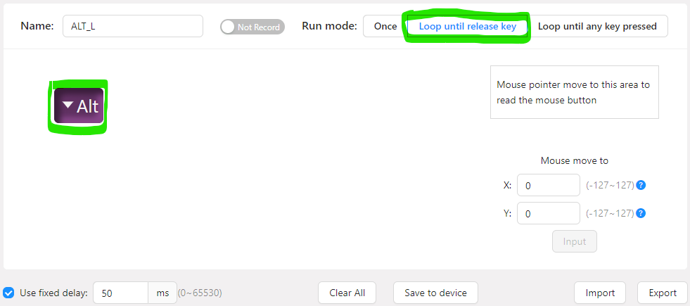
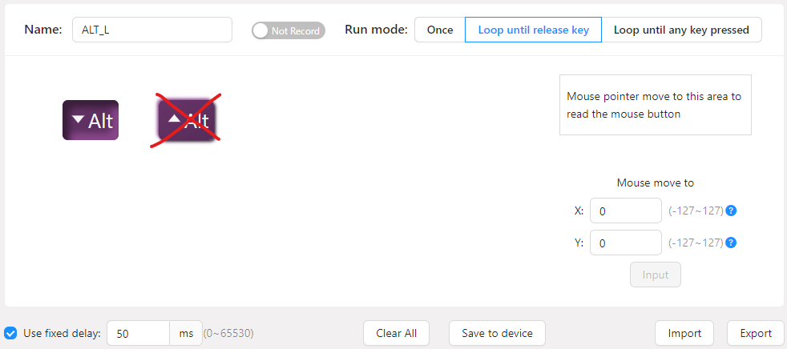

# FootSwitch App

## Table of contents

- [Author](#author)
- [Description](#description)
- [How to clone the repo](#how-to-clone-the-repo)
- [In case you want to use another FootSwitch device](#in-case-you-want-to-use-another-footswitch-device)
- [How to configure a valid macro for the FootSwitch on PCSensor customization software ElfKey](#how-to-configure-a-valid-macro-for-the-footswitch-on-pcsensor-customization-software-elfkey)
- [How to generate the executable](#how-to-generate-the-executable)

## Author

Sara Wysk

## Description

A desktop application designed to streamline measurement recording with the FootSwitch F22 device. 
This app allows users to create files and automatically log the start and end times of measurements 
with a simple press of the FootSwitch. Ideal for hands-free time tracking and data logging, the 
application ensures efficient and accurate recording of events.

## How to clone the repo

Run the following commands:
```
git clone https://github.com/sara59276/FootSwitch.git
cd FootSwitch
pip install virtualenv
virtualenv .venv
.\.venv\Scripts\activate
pip install -r requirements.txt
```
Optional: mark the `src` directory as sources root.

## In case you want to use another FootSwitch device

1. Check your device's vendor and model IDs (in 4-digits octal number format)
2. Update the keys `footswitch_vendor_id` and `footswitch_model_id` in `src/resources/config/config.ini` file  

## How to configure a valid macro for the FootSwitch on PCSensor customization software ElfKey

1. Set Run mode : "Loop until release key"
2. Set Macro : a key press without the release (cf. images below)
3. Make sure that both the key configured in the FootSwitch device and the `footswitch_key` 
in `src/resources/config/config.ini` file are the same.





## How to generate the executable
```
pip install pyinstaller
pyinstaller.exe --noconsole --onefile --name FootSwitch_App --icon=resources/img/app_icon.png --add-data "resources/img;resources/img" --add-data "resources/config/config.ini;resources/config" .\src\main.py
```
