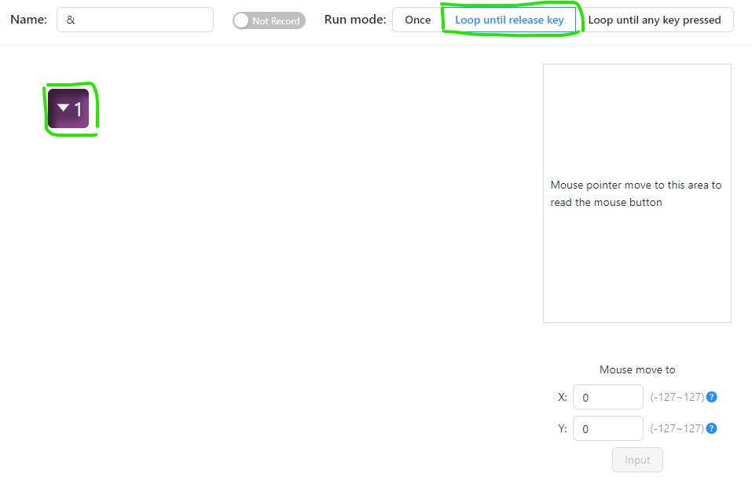
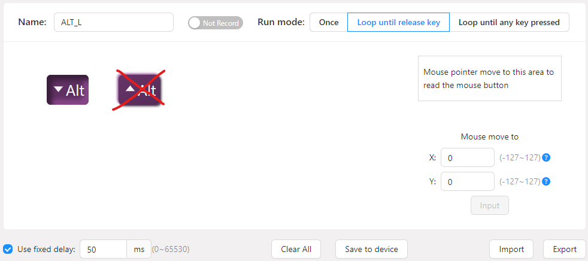

# Measurements with FootSwitch App

## Author
Sara Wysk

## Description
A desktop application designed to streamline measurement recording with the FootSwitch F22 device. 
This app allows users to create files and automatically log the start and end times of measurements 
with a simple press of the FootSwitch. Ideal for hands-free time tracking and data logging, the 
application ensures efficient and accurate recording of events.

## How to clone the repo
Firstly, run the following commands:
```
git clone https://github.com/sara59276/FootSwitch.git
cd FootSwitch
pip install virtualenv
virtualenv .venv
.\venv\Scripts\activate
pip install -r requirements.txt
```
Lastly, mark the `src` directory as sources root.

## How to configure a valid macro for the FootSwitch on PCSensor customization software ElfKey
2 conditions must be fullfilled :
- Run mode : "Loop until release key"
- Macro : a key press without the release (cf. images below)

NB : Make sure that both the key configured in the FootSwitch device and the
variable `FOOTSWITCH_KEY_SIMULATOR` in `constants/footswitch_device.py` file are the same.





## How to update the requirements.txt
```
.\venv\Scripts\activate
pip freeze > requirements.txt
```
## How to generate the executable
```
pip install pyinstaller
pyinstaller.exe --noconsole --onefile --name FootSwitch .\src\main.py
```
